# BPM-Caddy

**Clinical pharmacy workflow & analytics — fast, local, encrypted.**

BPM-Caddy is a desktop application that streamlines pharmaceutical consultations (BPMs, AODs, asthma interviews) at the dispensing counter. It is built for speed (instant launch, keyboard-first navigation), privacy (fully local, encrypted database — no cloud), and accountability (financial tracking that demonstrates the ROI of clinical activities).

> **Status: in development.** Binaries are published on the [Releases](../../releases) page.


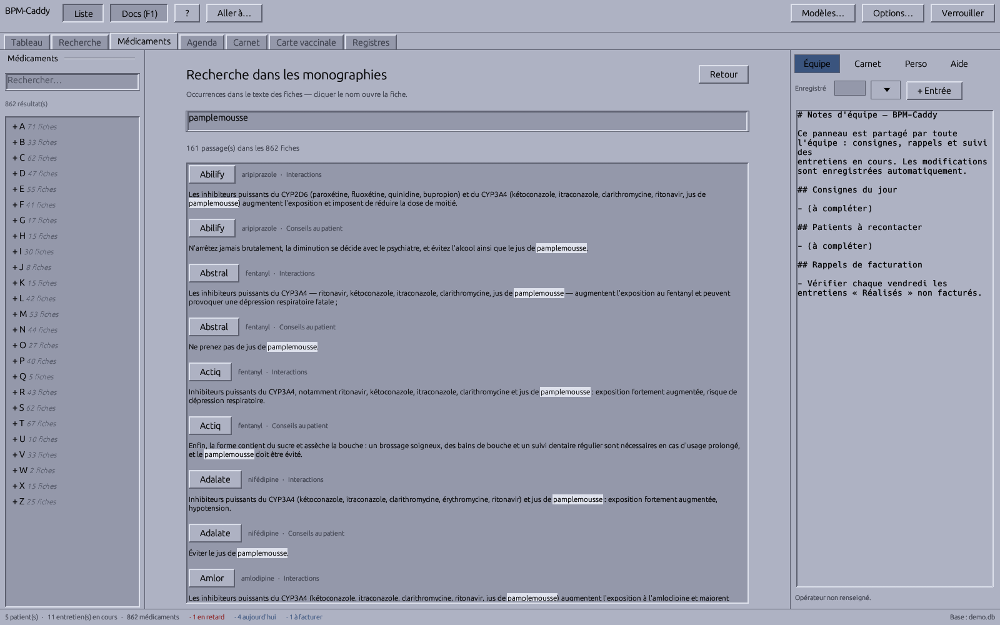

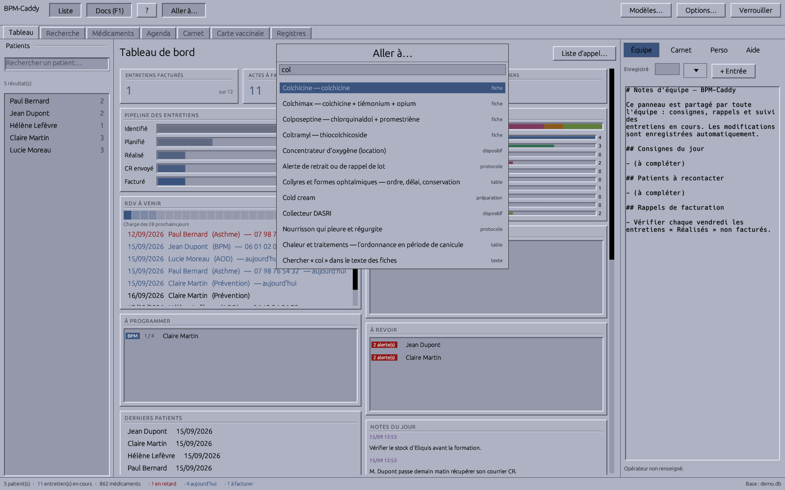


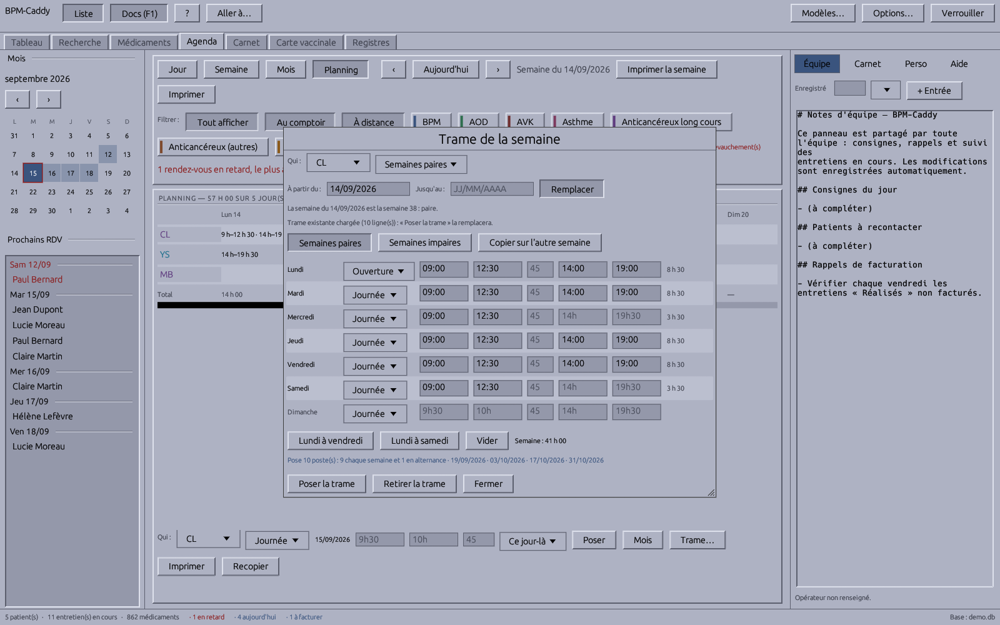

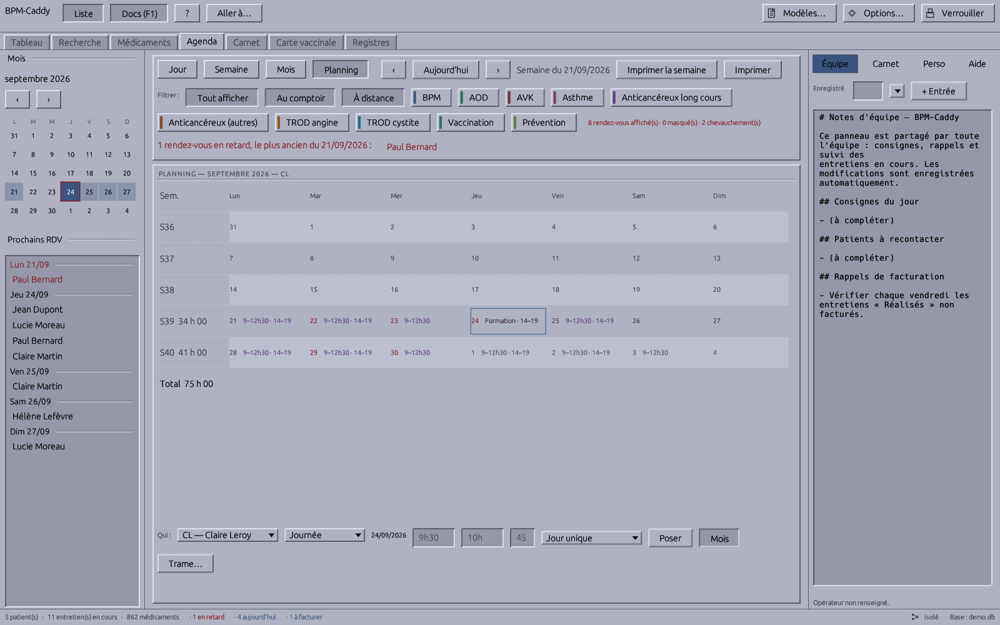


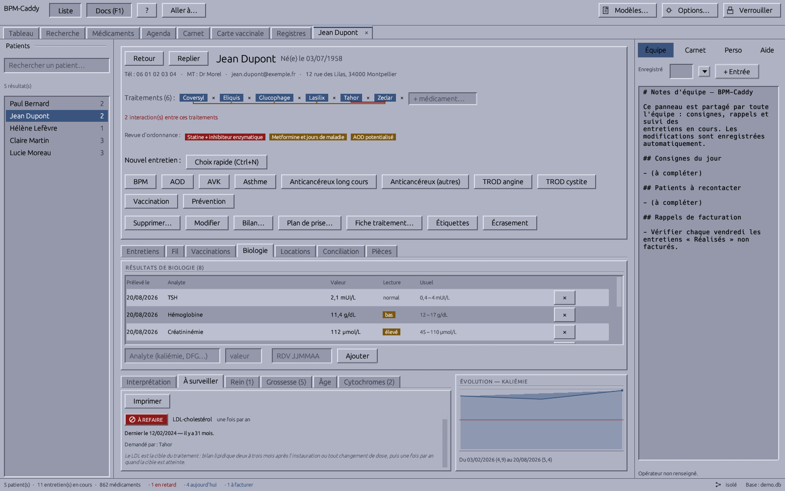


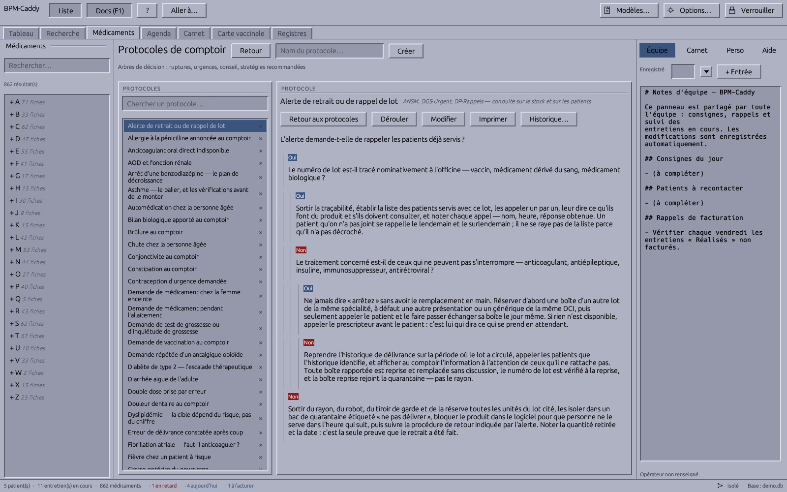

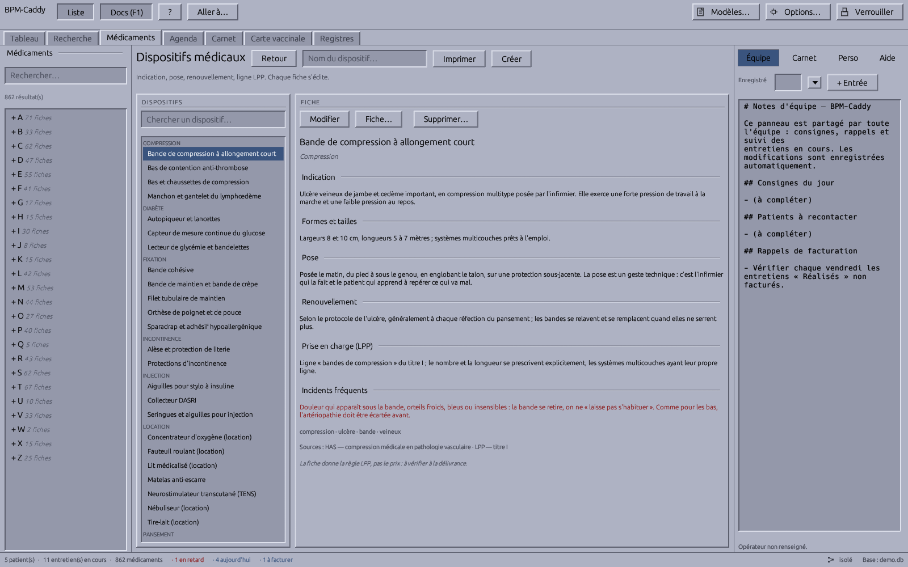

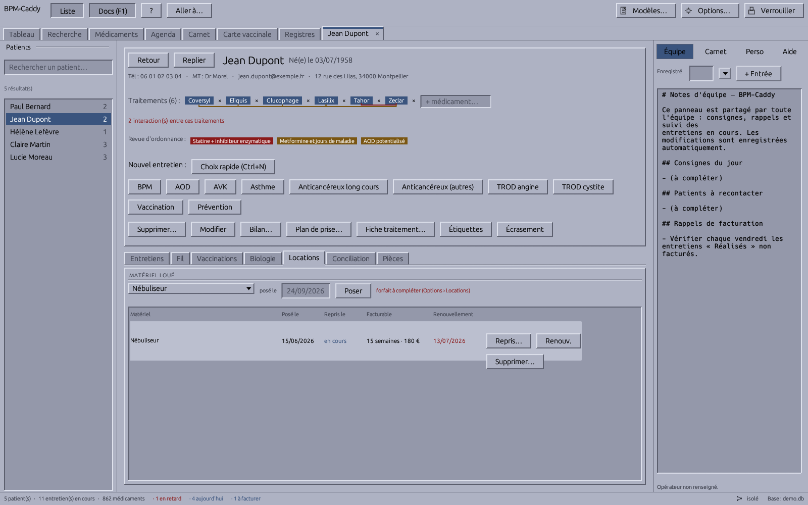

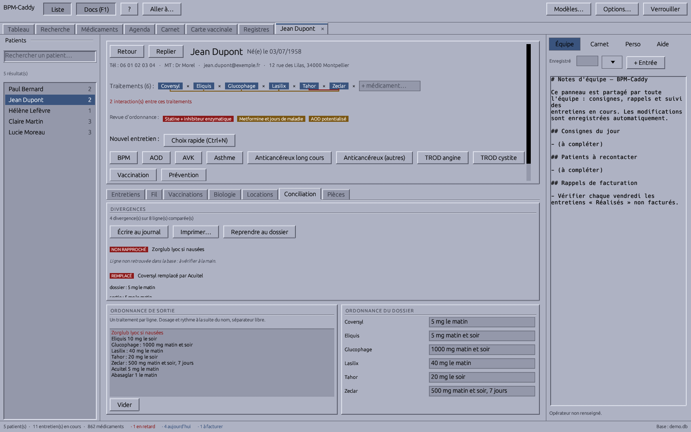


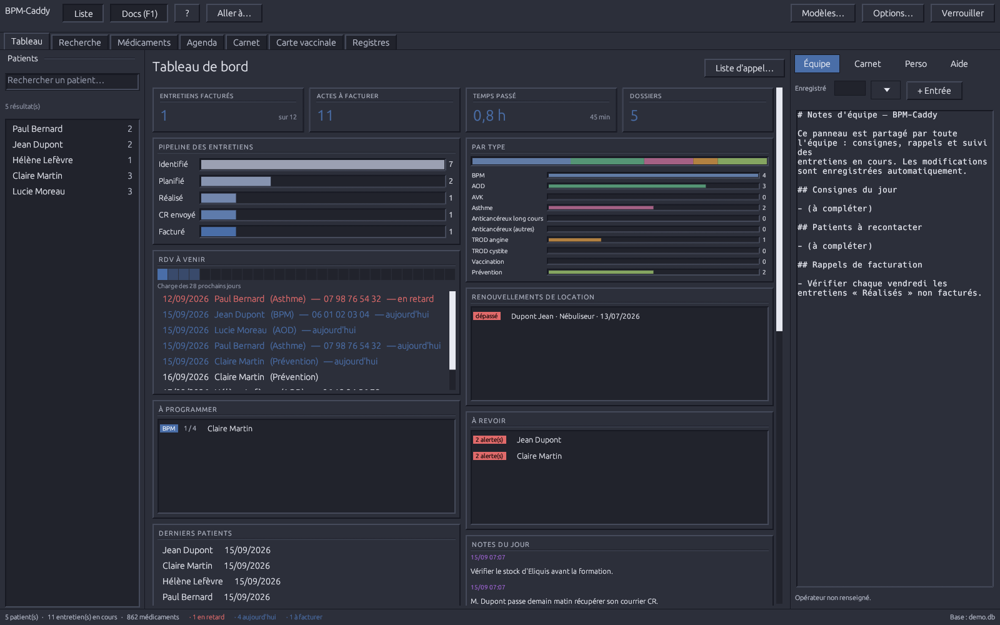

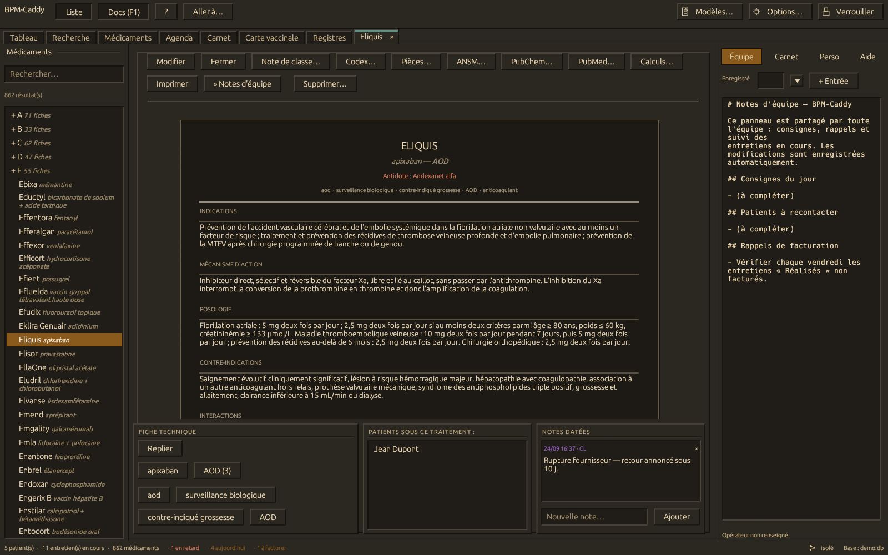

## Key features

### Search and navigation

- **Global search (`Ctrl+K`)** — « Aller à… » searches patients, drug cards (brand and DCI), reference tables, preparations, medical devices, protocols and views in one list. Arrows to move, `Entrée` to open, `Échap` to close without changing the view. The last row, always in view, runs a full-text search of the monographs.
- **Several networks** — an officine can belong to several networks at once (its groupement, a local garde network, or a two-officine link with any officine it pairs with), serverless: each with its own key, members, exchange folder and sharing switches; messages and files travel through whichever network joins the recipients.
- **Connection map** — the officine's posts and the network's officines drawn around this post, each link in its state (solid, thin, dashed, dotted); click a node to write, send a file, dial it or sync.
- **Messaging** — conversations between colleagues across the officine's posts (a few colleagues, a named group, or the whole team), and with other officines of the network, each message sealed for its recipient officines only (the rest of the network carries it unreadable); a message can link the open patient file, with an explicit, audited consent before it leaves the officine; unread count in the status bar; favorite contacts; encrypted file send (chunked, hash-checked before saving).
- **Favorites** — star a patient file, a drug card, a tool or a view; favorites lead the jump box, per operator, and follow them across the officine's posts.
- **Tools found by what they are for** — twenty-one tools behind tabs, dialogs and option pages (week pattern, network, posts, register, returns, printed texts, templates, backups…) are reached by the counter's words: « horaires », « périmés », « sauvegarde », « angine ». Opened empty, the box lists the last five destinations, the views, then the tools; `F12` lists them too, and the Aide tab opens on the section about the current view. After an update, a « Nouveautés » window shows once what changed.
- **Full-text monograph search** — « Dans le texte… » covers every section of the cards: interactions, contraindications, adverse effects, monitoring, missed-dose advice, strengths and the team's notes are searched, and so are the 1 736 posology lines, each returned under its indication. Accent- and case-insensitive; each hit is quoted as written, under its section name, one click from its card. With a patient file open, one button restricts the search to that patient's treatments.
- **Quick bar (`F9`)** — a compact, always-on-top window beside the LGO. Type a name or DCI, or scan a box: the DataMatrix lot and expiry are decoded, and expiry is the only verdict given. Five pages per card — Signaux, Posologie, Conseils, Précautions and, with a file open, Dossier — navigated with the arrow keys and `Alt` + 1 … 5. « Précautions » opens on the organs the drug can harm, most serious first. Against an open file, the card is shown in chips: ten readings of that one card — interactions cited by the file's monographs, ordonnance review, duplicate molecule under another brand, biology, required monitoring, cytochromes, crushing, pregnancy and breastfeeding, renal function, age. Each chip cites its source and concludes nothing; when no table has data, the bar says so. A chip opens « Croiser une liste » on its chapter.
- **Drug index** — an A–Z tree with per-letter counts; typing switches to ranked matches. Each row shows brand and DCI.
- **Carte Vitale** — reads the card's beneficiaries (holder and ayants droit) over PC/SC and opens, or pre-fills, the file with the matching NIR — never matched on name. Identity only, no billing: an FSE requires an approved SESAM-Vitale package and a CPS card. Posts without a reader are unaffected.
- **Dockable workspace** — open patients and drug cards are tabs (`Ctrl+Tab`, `Ctrl+W`); a left navigator (`F6`) and a right pane (`F1`) for team notes and the manual. Dock widths, window size and the last view are restored at next launch.
- **Keyboard-driven** — `Ctrl+F` search, `Ctrl+N` new consultation, `F1`–`F12` for views and panes; compact date entry (`230826`, `2308`, or `23/08/2026`).

### Patient file

- **Record** — contact details, médecin traitant, counter notes, current treatments linked to the drug base, dated note journals.
- **Consultations and billing** — BPM, AOD, AVK, asthme, the two oral anticancer supports (long cours, autres), TROD angine, TROD cystite, vaccination and RDV prévention, each with its quota, agenda colour, date, operator and rank-based fee (entretien initial, 1er suivi, suivants). Every act moves through `Identified → Scheduled → Performed → Report sent → Billed`. Convention rules are enforced (annual quotas, 12-month cycle); a blocked creation shows the next eligible date and can be overridden explicitly.
- **Vaccination record** — doses (vaccine, dose, date, lot, site, operator), printable as an A4 carnet. « À faire » checks the record against the calendrier vaccinal and can write the schedule as undated lines; « Voyage » checks recommended vaccines for recorded destinations. A dose without a matching act is flagged for billing.
- **Biology** — results with interpretation against usual adult intervals and a trend chart. The interpretation panel applies a hundred and one rules that tie a value to the patient's treatments: kaliémie above 5 under IEC or spironolactone, DFG under 30 with an AOD or metformine, INR above 5 under AVK, CPK above five times normal under a statine, thrombopénie under héparine, hyperammoniémie under valproate.
- **« À surveiller »** — the monitoring the treatments require: analyte, interval, last result and time elapsed (INR under AVK, clairance under AOD, lithémie, TSH under amiodarone, NFS under clozapine, calcémie before dénosumab, B12 under metformine…). Sixty-five of them. Four statuses, one alert: « à refaire » (date past); « non renseigné » means missing data. Two treatments requiring the same analyte share one line at the shorter interval.
- **Revue d'ordonnance** — rules on the classes and tags of the cards: triade néfaste, double blocage du SRA, anticoagulant + AINS, benzodiazépine + opioïde, allongeurs du QT, charge anticholinergique, clopidogrel + oméprazole, contraception sous inducteur enzymatique, bêtabloquant en collyre… Shown as chips on the file and in full on the bilan. Two rules detect an absence: opioid without laxative, long-term corticotherapy without bone protection.
- **Cytochromes** — inhibitors and inducers per enzyme on the file's treatments, with strength and the source sentence from the card (a test refuses an unsourced claim). Three answers: unknown, no relevant pathway, interaction. Prodrugs are handled (inhibition reduces clopidogrel's effect). Stated limits: no P-glycoprotein, transporters, additive effects, dose or duration.
- **Renal function, hepatic impairment, elderly patients** — renal: RCP thresholds against the latest DFG. Hepatic: a Child-Pugh stage assigned by the clinician (three buttons, never computed); active liver disease is out of scope. Elderly: Laroche list, STOPP/START, Beers, HAS and ANSM; each row gives the risk and an alternative, never an abrupt stop, and the section prints on the bilan partagé de médication.
- **Conciliation médicamenteuse** — paste the discharge prescription; each line is classified reconduit, dose modifiée, arrêté, ajouté or remplacé (same class). Unmatched lines are listed first. Write to the journal, adopt the discharge posologies, or print the sheet for the prescriber with a reply box.
- **Equipment rental** — per patient: periods started counted against the forfait in force on the start date, renewal alerts on the dashboard, a dedicated table on the billing summary. No forfait ships with the app: they are set in Options › Locations.

### Clinical tools

- **« Croiser une liste »** — a list without a patient file: cytochromes (drawn as a map), exposure duration from half-life, ordonnance review, renal adaptation at a given clairance, hepatic adaptation at a given stage.
- **Carte pharmacologique** — a drug card at the centre, with same-molecule, same-class and interaction links around it; « Ordonnance » mode draws the file's treatments with one link per interaction found.
- **Drug reference base** — A fresh base starts with 862 common drugs, each a full monograph (indications, mechanism, posology, contraindications, interactions, adverse effects, monitoring, counselling, pharmacokinetics, numbered sources), with posology lines per indication, missed-dose advice and warning signs. Every field is editable; a content update never overwrites the team's edits. Each card lists the patients currently on it. Clickable molecule names, a technical sheet (half-life decay curve, narrow therapeutic margin), and PubChem, PubMed and ANSM lookups in the browser.
- **Insulin profiles** — onset, peak and duration per insulin, overlaid on one axis; carbohydrate ratio (500 rule), sensitivity factor (1800 rule, g/L and mmol/L), meal and correction bolus, basal titration.
- **Reference tables** — forty-six counter references browsable in-app, printable, with numbered sources and a review date: dose equivalences, dosing by renal function, paediatric doses by weight, crushing, pregnancy and breastfeeding, emergencies, elderly patients, inhaler technique, antidiabetics and sick-day rules, antibiotics, abrupt discontinuation, dermocorticoids, driving, heat, photosensitivity, pill organisers, LDL, heart failure, CHA₂DS₂-VASc and HAS-BLED, HbA1c, CKD stages. One search field covers all tables.
- **Counter protocols** — decision trees (oui/non branches, conduites) walked step by step and printable: shortages, oubli de pilule, piqûre de tique, brûlure, douleur thoracique, chute du sujet âgé, ordonnance de sortie d'hôpital, bilan biologique, erreur de délivrance, sevrage tabagique. Edited protocols are never replaced by updates.
- **Codex of preparations** — the officine's magistral and officinal formulas, eighty to start with, including paediatric oral suspensions: formula, mode opératoire, conservation, sources. Quantities scale to the batch; the fiche de fabrication prints with lot, operator and control columns. Calculators for titre, dilution and capsule batches.
- **Medical devices** — fiches by family (dressings, fixation, compression, stomie, sondage and incontinence, injection, respiratory, rental equipment): indications, sizes, application, renewal, LPP conditions, common errors. The LPP field states the rule, never the price.
- **Stupéfiants register** — A catalogue of 158 presentations of the French market ships with the app, each with dosage, counting unit, maximum prescription length and family rule; the officine follows only what it stocks (all 158 followed would be 158 zero balances). The balance is set by inventory. Numbers are sequential per year and never reissued. The register is insert-only (R. 5132-36): a correction is an `ANNULATION` line with a mandatory reason, the cancelled line stays struck through on screen and on paper. Patients appear as file numbers, never names. Stored in its own encrypted file.
- **Checklists** — the officine's own lists (opening, cold chain, delivery, emergency kit), printed with boxes, a blank date and « Par : ».

### Team and activity

- **Dashboard** — indicators, pipeline funnel, monthly billed vs. pending revenue, act mix and quotas, 28-day load, upcoming appointments (printable). « À programmer » lists accompaniments with no appointment scheduled; « À revoir » is the call list (biology, ordonnance review, overdue monitoring), printable; « Ruptures en cours » lists the shortages reported here and by the network, with the substitute most given. A fresh base opens on « Premiers pas ».
- **Team planning** — the week by person with counter coverage against opening hours; « Trame… » sets a person's standard week at once — split days, even/odd alternation, a drawn column showing both weeks against the opening hours, « Reprendre de… » to start from a colleague's.
- **Agenda** — week grid coloured by act, month view, filters, day panel with appointments, other entries and notes; the week prints as a landscape A4.
- **Team notes and transmissions** — a shared right pane with auto-save and entry stamps; `F5` opens the end-of-day handover log, one page per day, printable.
- **Operators** — `[pharmacy] operators` lists the team; each act records who performed it, and that person signs the printed documents.
- **CSV export** — every consultation, for billing reconciliation with the LGO.

### Printing

- **Typst, embedded** — templates are compiled in-process and sent to the PDF viewer or printer. The interview sheet (with the theme's checklist), CR letter, carnet page, ordonnance and others are editable in-app (« Modèles… »), with compile validation, sample previews and the list of markers.
- **Patient documents** — « Plan de prise »; « Fiche traitement » for a new prescription (dosing grid by time of day, dispensing and renewal status, advice, missed-dose advice and warning signs per drug); bilan partagé de médication with interactions, biology, vaccinations and the year's acts.
- **Bulletin d'adhésion** — the official Assurance Maladie PDF, form fields pre-filled; checkboxes, date and signatures left blank.
- **Ordonnance after a positive TROD** — antibiotics allowed for the indication, usual posology pre-filled and editable, adjuvants from cards tagged « probiotique », printed with the officine's N° AM.
- **Act-specific sheets** — a TROD prints its own sheet (orientation signs, the Mac Isaac score for angine, test reading with lot and expiry, what to do on each result, the protocol lines that fit the patient) and a letter to the médecin traitant; a vaccination prints the pre-injection questions, the traced vaccine and what the calendar still owes. The entretien sheet adds a table per act (INR, anticoagulant follow-up, adverse-effect grades, inhaler technique, medication-review findings, prevention plan) and the next appointment. Every printed phrase can be rewritten by the officine.
- **Mode d'emploi** — `F12` lists the shortcuts and prints the handout: seventeen sections in two columns on one sheet. The on-screen manual, with search, sits in the right pane alongside the scripting console's API reference.

### Data, security and configuration

- **Encrypted at rest** — SQLCipher (256-bit AES); the key comes from a master password or the OS credential manager. Daily encrypted snapshots in `backups/`.
- **Several posts, one base** — compare-and-set writes, periodic reload, merged team notes; optional encrypted peer-to-peer replication between posts.
- **Network of officines** — shortages and substitutions, sourced pharmacokinetic values, and versioned drug cards, preparations, protocols, TROD lines and the vaccine catalogue travel between the officines of a groupement (never a patient), field by field with arbitration. Each paired officine shows what it sent, when news last came, and whether it answers directly — with a readable reason when it does not.
- **Configurable text** — every UI string lives in an embedded TOML and can be overridden by a `strings.toml` next to `config.toml`, or in-app under « Libellés ». A rewrite whose original changes in a later version is flagged for review. No built-in disclaimer: mentions live in `[disclaimers]`, empty by default.
- **Auto-updating launcher** — `bpm-caddy-launcher` checks GitHub Releases at startup, with an offline fallback to the installed copy.
- **Test coverage** — `./scripts/coverage.sh` enforces two floors that only move up; `scripts/smoke.sh` opens every view at four window shapes and fails on any panic.
- **X/Motif theme** — square corners and raised/sunken bevels, as a reusable `motif` crate for egui.
- **Ten skins, and the shape never moves** — five historical workstation palettes (mwm, CDE, DECwindows, Indigo Magic, HP VUE), three for visual comfort (bright light, faded screen, low glare) and two dark palettes for night duty. A palette changes colours only; categorical colours are fitted to each palette with their hues and spacing preserved, checked by a test.

## Technology

| Layer | Choice |
|---|---|
| Language | Rust |
| UI | [egui](https://github.com/emilk/egui) (immediate-mode, sub-50 ms startup) |
| Documents | [Typst](https://typst.app) embedded as a Rust crate |
| Database | SQLite + SQLCipher via `rusqlite` |
| Charts | hand-painted with egui primitives (no plotting library) |

The full requirements document lives in [`docs/SPECIFICATIONS.txt`](docs/SPECIFICATIONS.txt), and [`docs/CONTENU.md`](docs/CONTENU.md) maps the clinical content: where each kind of it lives, what seeds it, what test holds it, and how to add to it.

The repository is a Cargo workspace:

| Crate | Purpose |
|---|---|
| `bpm-caddy` (root) | The main application |
| `launcher/` | Auto-updating launcher (`bpm-caddy-launcher`) |
| `motif/` | X/Motif look-and-feel for egui (palette, bevels, widgets) |

## Installing

Download **`bpm-caddy-launcher`** for your platform from the [Releases](../../releases) page and run it. It fetches the latest BPM-Caddy binary into your local data directory, keeps it up to date on every start, and launches it. If the network is unavailable, it starts the already-installed version.

## Configuration

BPM-Caddy reads a `config.toml` from the platform config directory:

```toml
[database]
# Point this at the pharmacy network drive to share the database — the
# team documentation file (notes_equipe.md) lives next to it and is
# shared the same way.
path = "Z:/LGO_Shared/bpm_caddy.db"
auto_lock_timeout_minutes = 15
# Daily snapshots kept in backups/ (0 disables them).
backups_keep = 14

[ui]
show_docs_on_start = true
# Mask dashboard amounts until revealed via the small corner control.
discreet_finances = true

[billing]
# Fees in euros, per act and per rank in the année d'accompagnement:
# entretien initial / 1er suivi / 2e suivi and beyond. A plain number
# applies the same fee to all three ranks.
bpm = { initial = 60.0, suivi_1 = 20.0, suivi_2 = 20.0 }
aod = { initial = 40.0, suivi_1 = 20.0, suivi_2 = 20.0 }
trod_angine = 10.0
```

### Several PCs on one shared database

Concurrent use from several posts is supported: writes wait politely for
each other (5 s), a state change made from a stale view is rejected
instead of overwriting a colleague's work, the open views re-read the
database every minute, and concurrent edits of the shared team notes are
merged line by line instead of last-writer-wins.

One requirement is outside the app's control: SQLite relies on the
network share honoring file locks. Windows Server / real SMB shares are
fine; some consumer NAS boxes are not — if in doubt, avoid two posts
writing heavily at the same instant. The automatic daily snapshots in
`backups/` are the safety net either way: to restore one, close the app
on every post and replace `bpm_caddy.db` with the chosen snapshot (the
master password is unchanged).

## Roadmap

- [x] Auto-updating launcher (GitHub Releases, offline fallback)
- [x] X/Motif theme (`motif` crate)
- [x] Docked team documentation pane (French, auto-saved)
- [x] Application shell: instant-launch egui window, global fuzzy search
- [x] Patient records: quick creation, encrypted SQLCipher storage
- [x] Interview lifecycle state machine
- [x] Typst template engine integration and PDF spooling
- [x] Financial dashboard (revenue chart, pipeline funnel, hourly ROI)
- [x] Configuration file (database path, auto-lock, fees) and OS credential-manager key storage
- [x] Packaged releases for Windows / macOS / Linux
- [x] Multi-post concurrency (compare-and-set states, merged team notes)
- [x] Automatic daily backups and master-password change (rekey)
- [x] Patient contact details, printable RDV list, CSV billing export

## License

BPM-Caddy is **proprietary software with free public releases**: you may use the official binaries free of charge (including professionally) and read the source, but redistribution, modification, and reuse of the code are not permitted. See [LICENSE](LICENSE) for the exact terms.

BPM-Caddy is not a medical device. Users are responsible for compliance with applicable health-data regulations (e.g., GDPR) in their jurisdiction.
