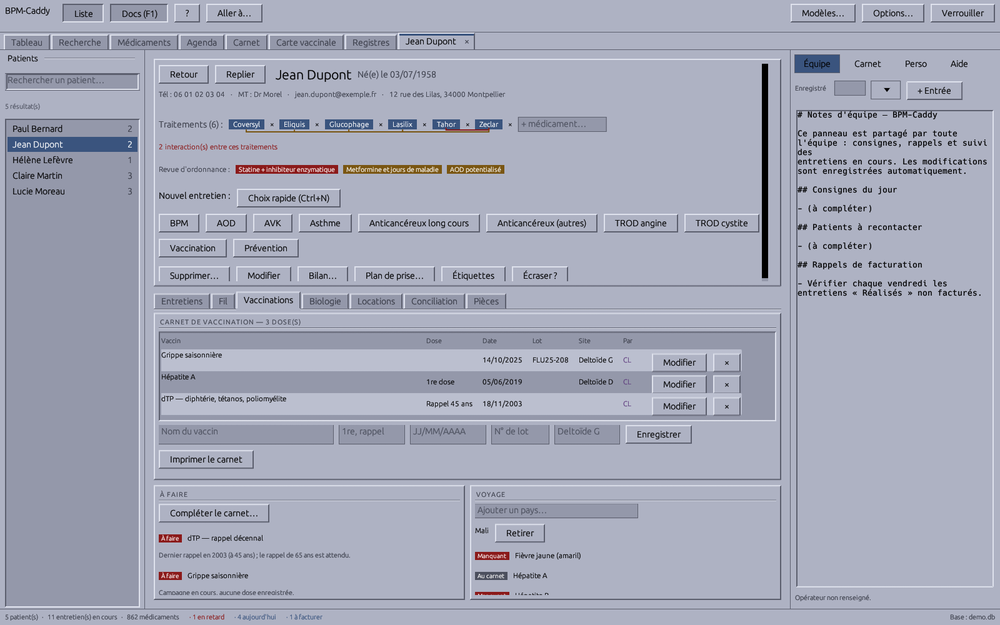
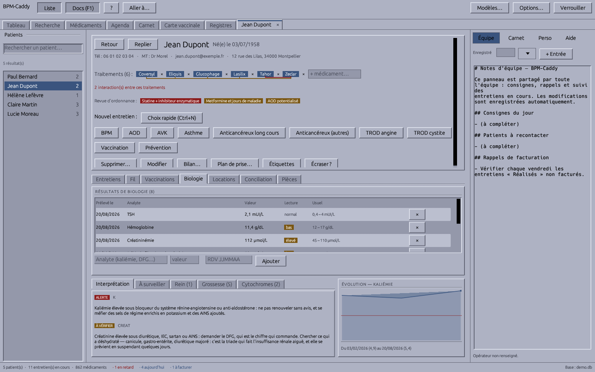
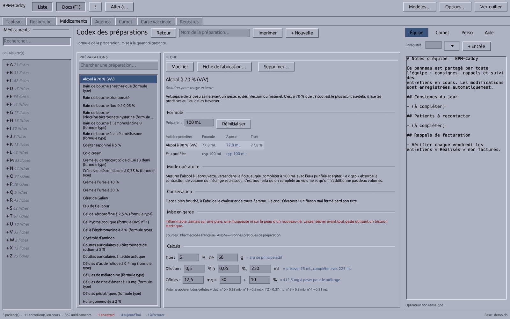
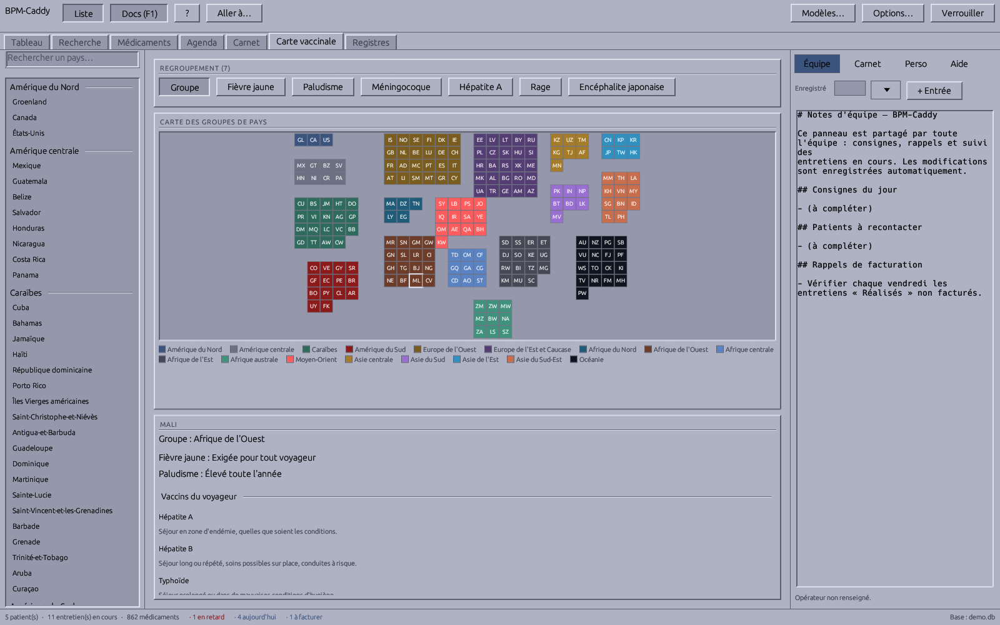

# BPM-Caddy

**Clinical pharmacy workflow & analytics — fast, local, encrypted.**

BPM-Caddy is a desktop application that streamlines pharmaceutical consultations (BPMs, AODs, asthma interviews) at the dispensing counter. It is built for speed (instant launch, keyboard-first navigation), privacy (fully local, encrypted database — no cloud), and accountability (financial tracking that demonstrates the ROI of clinical activities).

> **Status: in development.** This repository hosts the specification, roadmap, and source code as the project is built. Binaries will be published on the [Releases](../../releases) page.










## Key features

- **A dockable workspace** — the screen is a notebook between three docks, not one view at a time. Open patients and drug cards become tabs (`Ctrl+Tab` cycles, `Ctrl+W` closes), so two records stay one click apart; a left navigator (`F6`) holds the list the active view is browsing — patients, the drug index, the month — and a right pane (`F1`) holds the team's notes. Both docks resize, remember their state, and take a share of the window rather than a fixed slab. Every view is a grid of Motif panels that reflows with the window instead of a fixed column centred in it.
- **Instant fuzzy search** — the app launches straight into a global search bar; typing `jndp` finds *Jean Dupont*. No result? The search seamlessly becomes a patient-creation form.
- **Keyboard-driven workflow** — `Ctrl+F` search, `Enter` select, `Ctrl+N` new interview. Zero loading screens.
- **Native PDF generation with Typst** — clinical interview templates (BPM/AOD frameworks) are typeset in-process by the embedded [Typst](https://typst.app) engine and handed straight to your PDF viewer or printer. No LaTeX, no HTML-to-PDF wrappers.
- **Encrypted at rest** — the patient database is a SQLCipher file (256-bit AES). The key is derived from a master password or stored in the OS credential manager. No external APIs, no telemetry.
- **Billing pipeline state machine** — every interview moves through `Identified → Scheduled → Performed → Report sent → Billed`, so no billable act is ever lost.
- **Financial dashboard** — a grid of panels: indicator tiles that carry a revenue sparkline, the pipeline as a horizontal-bar funnel, monthly billed vs. pending revenue as gridded and axis-labelled bars, the act mix as a stacked composition bar over per-theme bars reporting their yearly quota, a 28-day load heat strip, and the upcoming appointments (overdue ones flagged, phone numbers shown, printable as an A4 list) with one-click access to the patient.
- **Compact date entry** — dates are typed the fast way: `230826`, `2308`, or the full `23/08/2026`; birth dates and appointment dates expand two-digit years sensibly (past vs. 20xx).
- **Automatic daily backups** — after each unlock, a consistent encrypted snapshot is kept in `backups/` next to the database (14 most recent).
- **CSV export** — one click on the dashboard writes every interview (patient, dates, duration, fee) to a French-Excel-friendly CSV for billing reconciliation with the LGO.
- **Portable** — a single standalone executable for Windows, macOS, and Linux. The database path is configurable, so it can live on a secure pharmacy network drive.
- **Auto-updating launcher** — `bpm-caddy-launcher` checks GitHub Releases on startup, downloads the latest version if needed (with an offline fallback to the installed copy), then starts the app. Install the launcher once; the app stays current.
- **Team documentation pane** — the right dock (`F1` to toggle), an editable French documentation panel with auto-save, for shared day-to-day notes and team syncing at the counter. One click stamps a succinct entry header (date · operator · current patient).
- **Dated note journals** — append-only, author-stamped notes on every patient, every drug, and per-operator personal notes, separate from the shared pane.
- **Carnet de transmissions** — `F5` opens the end-of-day handover logbook: one page per day, stamped team entries, day-by-day browsing, printable for the binder.
- **Carnet de vaccination** — every patient file has a second tab: the doses received (vaccine, dose, date, lot number, injection site, operator), correctable in place and printable as an A4 carnet. Beside it, two panels read themselves: **À faire** checks the carnet against the calendrier vaccinal (dTP milestones at 25/45/65 then every ten years, the flu and COVID campaigns, zona from 65, VRS from 75, pneumocoque, ROR for the 1980 cohort, HPV) and says what is owed and why — and one click writes the whole schedule into the carnet as undated lines the counter then fills in, corrects or deletes, nothing recorded as given; **Voyage** lists the destinations recorded on the file and ticks each recommended vaccine off against the doses already there, so what stays *manquant* is the conversation to have.
- **Vaccination map** — `F7` opens the world as a cartogram: one square per country, grouped into regions laid out roughly where they belong. Hovering a country gives its group, its yellow-fever status, its malaria risk and the vaccines a traveller needs; clicking pins it in the detail panel, and one button records it as a destination on the open patient's file. Seven lenses recolour the map — group, fièvre jaune, paludisme, méningocoque, hépatite A, rage, encéphalite japonaise — so one glance answers the counter's question. The data is indicative: the calendrier vaccinal in force and the year's BEH « Recommandations sanitaires pour les voyageurs » stay the authority, and every panel says so.
- **Drug reference base** — `F3` opens the team's shared drug cards (DCI, dosage, interactions, IUP, antidote, notes): two typed letters — brand or DCI — show the essentials at a glance, no match becomes a new card, and any card inserts into the team notes in one click. A fresh base starts with 812 common drugs, every one of them a full monograph — indications, mechanism, posology, contraindications, interactions, adverse effects, monitoring, counselling points, pharmacokinetics and numbered sources — covering the anticoagulants, the inhalers, the narrow-margin drugs, the oral anticancer drugs, the antibiotics and the psychotropes. On top of the monograph, 1 204 posology lines on 296 of those cards, indication by indication, each with the remark that matters at the counter — and, on 423 of them, what to do when a dose is missed and what must send the patient to a doctor. Every field is editable, and a top-up never overwrites what the team has written. Stored encrypted with the rest.
- **Agenda** — `F4` opens on the current week as a colored grid (one block per rendez-vous with its hour, colored by act kind, today highlighted, click-through to the patient), with a month view beside it, arrow-key navigation, a filter per act kind, the day-grouped list below, and a day panel that details any day: its rendez-vous — where the hour is set and a rendez-vous is moved to another date — the entries that are not acts (formation, réunion, livraison, congé) and that day's own notes. The week prints as a landscape A4 plan.
- **Ten billable acts** — the full conventioned set: BPM, AOD, AVK, asthma, the two oral-anticancer supports (long cours and autres), TROD angine, TROD cystite, vaccination, and RDV prévention, each with its own quota and agenda color. Each act carries the day it was held — editable, since that date places it in its cycle and picks its fee — and the initials of who did it. A TROD carries neither theme nor duration: it has a result.
- **Per-rank fees** — the convention pays the entretien initial, the 1er suivi and the following ones differently: fees are a 9×3 matrix in Options, each act shows its rank and fee, and the dashboard, patient table and CSV all bill by rank.
- **Paper-styled monographs** — a drug card opens as a printed monograph on a sheet of paper: uppercase section headings, the pharmacokinetics as a definition list and the numbered sources at the foot. "Modifier" switches to the editable form, "Imprimer" typesets the same sheet as an A4 PDF.
- **Thematics** — each entretien carries its theme (observance, biologie/INR, technique d'inhalation, interactions…), picked in one click and exported with the rest.
- **One-keystroke act creation** — `Ctrl+N` opens the quick picker: type the act's digit, optionally pick a theme, done.
- **Database file tools** — native file dialogs in Options to browse to an existing base, write a consistent encrypted copy anywhere (VACUUM INTO), or move the base (copy + repoint, old file kept).
- **Convention rules enforced** — N acts per année d'accompagnement per kind, with the 12-month cycle rule; a blocked creation shows the next possible date, overridable explicitly.
- **In-app options** — pharmacy identity, fees, quotas, auto-lock, backups and more, edited from the "Options…" dialog; config.toml stays the storage.
- **Full patient record** — phone, médecin traitant, e-mail, address, counter notes, and the patient's **current treatments** linked straight to the drug base (chips on the patient view, one click from the drug card).
- **Ordonnance after a positive TROD** — a TROD act records what the test read; a positive one opens a box offering the antibiotics that indication allows, each with the situation it is for and its usual posology pre-filled and freely rewritable. Add an adjuvant — any drug card tagged « probiotique », with that card's own posology lines as its schemas, so stocking a new one means adding a fiche rather than a new version of the app — toggle the conseils hygiéno-diététiques and the temps de prise on or off, add free lines, and print an A4 ordonnance carrying the officine's N° AM. The molecules come from the app's own angine and cystite reference tables, and a test keeps the two from ever drifting apart.
- **Bulletin d'adhésion, pre-filled** — each act under the accompaniment convention opens the Assurance Maladie's own bulletin d'adhésion (the official ameli.fr PDF, one per theme, embedded as downloaded) with the patient's identity, the pharmacy's and the médecin traitant typed into its form fields. The NIR, the régime d'affiliation and the officine's N° AM are printed when they are on file and left blank when they are not. Every checkbox, the date and the signatures stay empty — those belong to the patient, in pen, in front of the form.
- **CR letter in one click** — each interview generates the report letter to the médecin traitant: pharmacy letterhead, patient, act, known treatments (DCI, class, dosage), synthesis and signature boxes.
- **Editable PDF templates** — the Typst sources of the interview sheet *and* the CR letter are editable in-app ("Modèle PDF…"), with compile validation and sample previews; no recompilation needed.
- **Recall-ready** — every drug card lists the patients currently on it, one click from their record.
- **Substitution protocols** — what to dispense when a drug cannot be, written as a decision tree: questions with their oui/non branches, conduites to follow, walked one step at a time at the counter and printable as an A4 page.
- **Reference tables** — twenty-five counter references browsable in-app and printable as a four-page A4 sheet, each with its numbered sources: dose equivalences (IPP, statines, corticoïdes, opioïdes, benzodiazépines), dosing references (HBPM, AOD with renal adaptation, inhaled corticosteroid steps, insulin profiles, non-opioid analgesics), and the decision aids the acts need (Cockcroft and CKD stages, Mac Isaac score for the angina TROD, first-line cystitis treatments, missed-pill conduct, adult vaccination boosters, paediatric doses by weight, and what may or may not be crushed), the three that answer a question asked without an ordonnance in hand (interactions to catch at the counter, the emergencies to recognise and orient, what may be dispensed in pregnancy and while breastfeeding), and five that answer the questions the others did not: the médicaments to reassess after 75 and what is proposed instead, the inhaler technique device by device with the error that makes each one fail, the antidiabetics with their sick-day rules, the collyres (order, five-minute delay, the red eye that gets oriented) and what is refused at the counter in self-medication. Each table says when it was last read against its sources, on screen and on the printout.
- **« Biologie à revoir »** — the dashboard carries the call list: the files whose latest results say something about their own treatments, loudest first, the reason on hover, one click to that patient's biology. It only appears when there is something on it.
- **Patient biology, read against the treatments** — a third tab on the patient file records what the laboratory gave (analyte, value, date), reads each result against its usual adult interval — normal, bas, élevé, or the critical threshold where it stops being a deviation — and draws the trend of any analyte with the bounds of its interval across it. Beside it, « Ce que ça change » applies twenty-one rules that tie a value to what the file says the patient takes: a kaliémie above 5 under IEC or spironolactone, a DFG under 30 with an AOD or metformine, an INR above 5 under AVK, CPK at five times normal under a statine, a thrombopénie under héparine. A value alone informs; a value with the treatment behind it alerts. Twenty-six analytes, from the DFG to the lithémie, each carrying the sentence that matters at the counter.
- **La revue d'ordonnance** — what a set of treatments says about itself, read from the classes and tags the cards already carry: la triade néfaste (bloqueur du système rénine-angiotensine + diurétique + AINS), le double blocage, l'anticoagulant avec un AINS, la benzodiazépine avec un opioïde, l'anticholinergique prescrit sous anticholinestérasique, deux AINS, deux IPP, deux allongeurs du QT, la charge anticholinergique, trois sédatifs, la statine avec un fibrate, le clopidogrel avec l'oméprazole… Twenty-two rules, shown as chips on the patient file with the sentence on hover, and in full on the bilan. A fixed combination counts for both of its halves; a doublon needs two distinct boxes.
- **The bilan partagé de médication, printed with what the file knows** — one button on the patient file gathers the treatments with their DCI, class and posology; **the interactions the file sees between them** — for each drug, the sentences of its own monograph that name another drug on the same file, quoted as they stand; the biology with its reading; what the calendrier vaccinal still owes; the year's acts. Then the two boxes filled during the entretien — analyse pharmaceutique and plan d'action — and the signature.
- **A codex of preparations** — the officine's magistral and officinal formulas, twelve to start with (vaseline salicylée, pâte à l'eau, crème à l'urée, gélules pédiatriques, sirop simple, glycérolé d'amidon…), each with its formula, mode opératoire, conservation, what goes wrong, and its sources. Type the quantity actually being made and every line is rescaled — the excipient's « qsp 100 g » becomes « qsp 60 g » — with each ingredient's strength read off the formula beside it. The fiche de fabrication prints with a blank column for the lot of every raw material, the operator, the date and the boxes for the control and the labelling. Three calculators sit under the sheet: the titre, the dilution (C1·V1 = C2·V2) and a batch of capsules. Adding a preparation is adding a fiche.
- **Clickable molecules, and a technical sheet** — every name of another card in a monograph's prose is a link to that card (accent- and case-insensitive, two-word DCIs taken whole). Beside the monograph, a collapsible technical sheet: the DCI, class and tags as chips that search the base, what is left of the drug 24 h after the last dose as a meter and a decay curve, the narrow therapeutic margin first in red, then the properties as property and value. « PubChem… » and « PubMed… » (newest first) sit next to the ANSM lookup — the application stays offline and hands a URL to the browser.
- **Two more answers on every card** — « En cas d'oubli » and « Ce qui doit faire consulter », the two questions asked most at the counter and written down least. A hundred and ten class rules fill them on 423 of the 505 starter cards, and only ever fill an empty field: a card the team has written to keeps what it says.
- **The team, by name** — `[pharmacy] operators` lists who works at the counter (initials, nom, qualité), edited in Options. Each act records who did it, and that person signs the fiche, the courrier au médecin traitant and the ordonnance — not whoever happens to print them. The initials travel to the CSV export.
- **No disclaimer the application wrote itself** — every mention it used to print or show lives in `[disclaimers]` in `config.toml`, empty by default and editable in Options › Mentions. An empty one prints no line at all; the officine writes what it wants said.
- **Customizable wording** — every UI string lives in an embedded TOML; drop a `strings.toml` next to `config.toml` to adapt any text (or translate the app) without recompiling.
- **Old-school X/Motif theme** — the classic `mwm` blue-grey look with square corners and raised/sunken bevels, implemented as a reusable `motif` crate for egui.

## Technology

| Layer | Choice |
|---|---|
| Language | Rust |
| UI | [egui](https://github.com/emilk/egui) (immediate-mode, sub-50 ms startup) |
| Documents | [Typst](https://typst.app) embedded as a Rust crate |
| Database | SQLite + SQLCipher via `rusqlite` |
| Charts | hand-painted with egui primitives (no plotting library) |

The full requirements document lives in [`docs/SPECIFICATIONS.txt`](docs/SPECIFICATIONS.txt).

The repository is a Cargo workspace:

| Crate | Purpose |
|---|---|
| `bpm-caddy` (root) | The main application |
| `launcher/` | Auto-updating launcher (`bpm-caddy-launcher`) |
| `motif/` | X/Motif look-and-feel for egui (palette, bevels, widgets) |

## Installing

Download **`bpm-caddy-launcher`** for your platform from the [Releases](../../releases) page and run it. It fetches the latest BPM-Caddy binary into your local data directory, keeps it up to date on every start, and launches it. If the network is unavailable, it starts the already-installed version.

## Configuration

BPM-Caddy reads a `config.toml` from the platform config directory:

```toml
[database]
# Point this at the pharmacy network drive to share the database — the
# team documentation file (notes_equipe.md) lives next to it and is
# shared the same way.
path = "Z:/LGO_Shared/bpm_caddy.db"
auto_lock_timeout_minutes = 15
# Daily snapshots kept in backups/ (0 disables them).
backups_keep = 14

[ui]
show_docs_on_start = true
# Mask dashboard amounts until revealed via the small corner control.
discreet_finances = true

[billing]
# Fees in euros, per act and per rank in the année d'accompagnement:
# entretien initial / 1er suivi / 2e suivi and beyond. A plain number
# applies the same fee to all three ranks.
bpm = { initial = 60.0, suivi_1 = 20.0, suivi_2 = 20.0 }
aod = { initial = 40.0, suivi_1 = 20.0, suivi_2 = 20.0 }
trod_angine = 10.0
```

### Several PCs on one shared database

Concurrent use from several posts is supported: writes wait politely for
each other (5 s), a state change made from a stale view is rejected
instead of overwriting a colleague's work, the open views re-read the
database every minute, and concurrent edits of the shared team notes are
merged line by line instead of last-writer-wins.

One requirement is outside the app's control: SQLite relies on the
network share honoring file locks. Windows Server / real SMB shares are
fine; some consumer NAS boxes are not — if in doubt, avoid two posts
writing heavily at the same instant. The automatic daily snapshots in
`backups/` are the safety net either way: to restore one, close the app
on every post and replace `bpm_caddy.db` with the chosen snapshot (the
master password is unchanged).

## Roadmap

- [x] Auto-updating launcher (GitHub Releases, offline fallback)
- [x] X/Motif theme (`motif` crate)
- [x] Docked team documentation pane (French, auto-saved)
- [x] Application shell: instant-launch egui window, global fuzzy search
- [x] Patient records: quick creation, encrypted SQLCipher storage
- [x] Interview lifecycle state machine
- [x] Typst template engine integration and PDF spooling
- [x] Financial dashboard (revenue chart, pipeline funnel, hourly ROI)
- [x] Configuration file (database path, auto-lock, fees) and OS credential-manager key storage
- [x] Packaged releases for Windows / macOS / Linux
- [x] Multi-post concurrency (compare-and-set states, merged team notes)
- [x] Automatic daily backups and master-password change (rekey)
- [x] Patient contact details, printable RDV list, CSV billing export

## License

BPM-Caddy is **proprietary software with free public releases**: you may use the official binaries free of charge (including professionally) and read the source, but redistribution, modification, and reuse of the code are not permitted. See [LICENSE](LICENSE) for the exact terms.

BPM-Caddy is not a medical device. Users are responsible for compliance with applicable health-data regulations (e.g., GDPR) in their jurisdiction.
