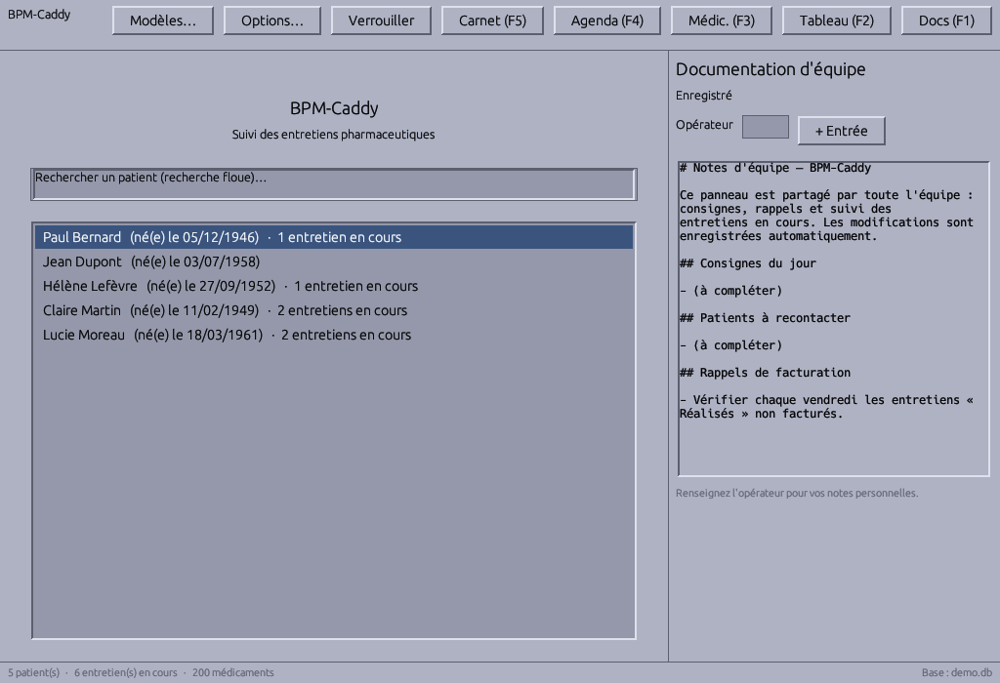
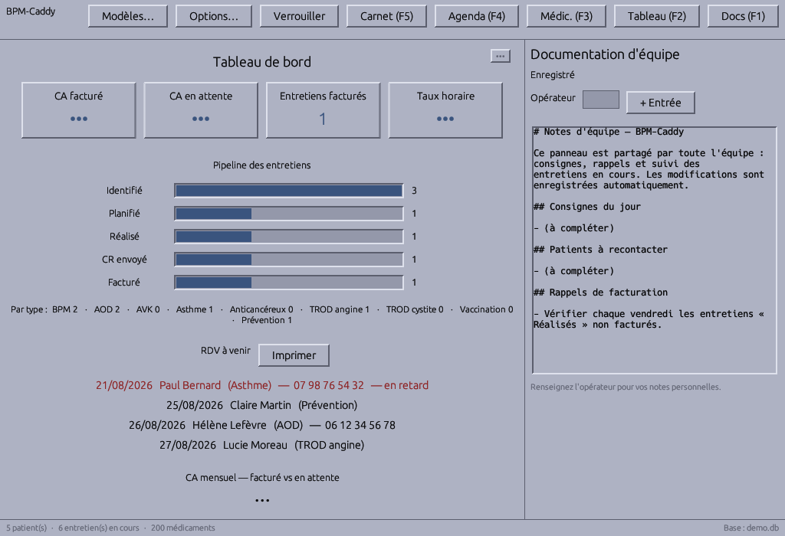
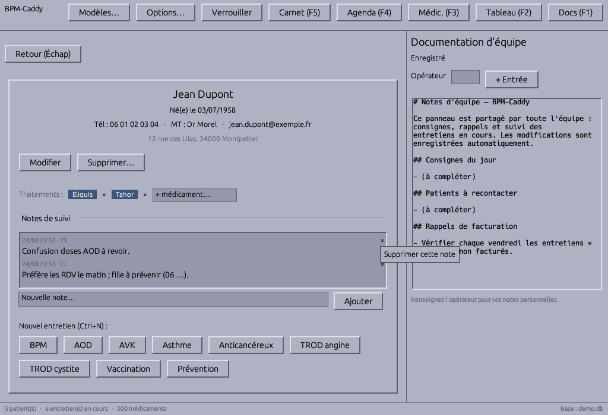
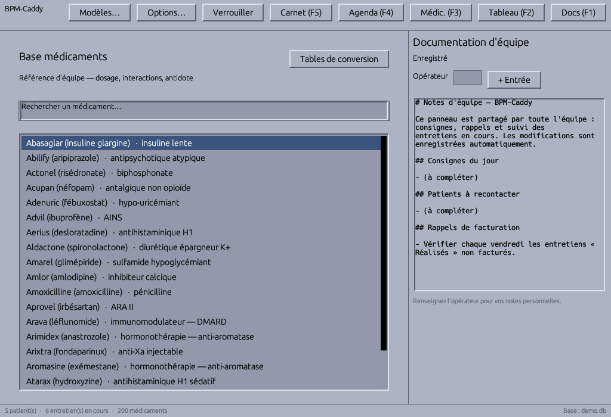
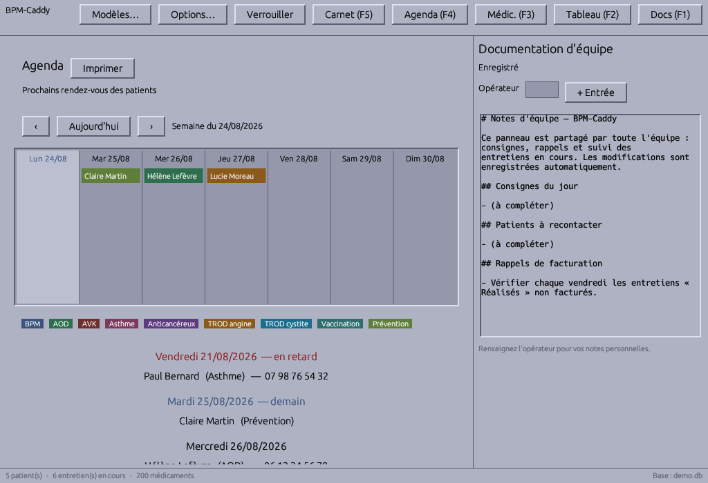

# BPM-Caddy

**Clinical pharmacy workflow & analytics — fast, local, encrypted.**

BPM-Caddy is a desktop application that streamlines pharmaceutical consultations (BPMs, AODs, asthma interviews) at the dispensing counter. It is built for speed (instant launch, keyboard-first navigation), privacy (fully local, encrypted database — no cloud), and accountability (financial tracking that demonstrates the ROI of clinical activities).

> **Status: in development.** This repository hosts the specification, roadmap, and source code as the project is built. Binaries will be published on the [Releases](../../releases) page.











## Key features

- **Instant fuzzy search** — the app launches straight into a global search bar; typing `jndp` finds *Jean Dupont*. No result? The search seamlessly becomes a patient-creation form.
- **Keyboard-driven workflow** — `Ctrl+F` search, `Enter` select, `Ctrl+N` new interview. Zero loading screens.
- **Native PDF generation with Typst** — clinical interview templates (BPM/AOD frameworks) are typeset in-process by the embedded [Typst](https://typst.app) engine and handed straight to your PDF viewer or printer. No LaTeX, no HTML-to-PDF wrappers.
- **Encrypted at rest** — the patient database is a SQLCipher file (256-bit AES). The key is derived from a master password or stored in the OS credential manager. No external APIs, no telemetry.
- **Billing pipeline state machine** — every interview moves through `Identified → Scheduled → Performed → Report sent → Billed`, so no billable act is ever lost.
- **Financial dashboard** — monthly billed vs. pending revenue, pipeline funnel, an hourly ROI rate computed from time spent, and the upcoming appointments (overdue ones flagged, phone numbers shown, printable as an A4 list) with one-click access to the patient.
- **Compact date entry** — dates are typed the fast way: `230826`, `2308`, or the full `23/08/2026`; birth dates and appointment dates expand two-digit years sensibly (past vs. 20xx).
- **Automatic daily backups** — after each unlock, a consistent encrypted snapshot is kept in `backups/` next to the database (14 most recent).
- **CSV export** — one click on the dashboard writes every interview (patient, dates, duration, fee) to a French-Excel-friendly CSV for billing reconciliation with the LGO.
- **Portable** — a single standalone executable for Windows, macOS, and Linux. The database path is configurable, so it can live on a secure pharmacy network drive.
- **Auto-updating launcher** — `bpm-caddy-launcher` checks GitHub Releases on startup, downloads the latest version if needed (with an offline fallback to the installed copy), then starts the app. Install the launcher once; the app stays current.
- **Team documentation pane** — a docked, editable French documentation panel (`F1` to toggle) with auto-save, for shared day-to-day notes and team syncing at the counter. One click stamps a succinct entry header (date · operator · current patient).
- **Dated note journals** — append-only, author-stamped notes on every patient, every drug, and per-operator personal notes, separate from the shared pane.
- **Carnet de transmissions** — `F5` opens the end-of-day handover logbook: one page per day, stamped team entries, day-by-day browsing, printable for the binder.
- **Drug reference base** — `F3` opens the team's shared drug cards (DCI, dosage, interactions, IUP, antidote, notes): two typed letters — brand or DCI — show the essentials at a glance, no match becomes a new card, and any card inserts into the team notes in one click. A fresh base starts with ~200 common drugs (names, DCI, classes, textbook antidotes). Stored encrypted with the rest.
- **Agenda** — `F4` opens on the current week as a colored grid (one block per rendez-vous, colored by act kind, today highlighted, click-through to the patient), with week navigation and the day-grouped list (overdue included) below. Printable.
- **Nine billable acts** — the full conventioned set: BPM, AOD, AVK, asthma, oral-anticancer support, TROD angine, TROD cystite, vaccination, and RDV prévention, each with its own configurable fee, quota, and agenda color.
- **Database file tools** — native file dialogs in Options to browse to an existing base, write a consistent encrypted copy anywhere (VACUUM INTO), or move the base (copy + repoint, old file kept).
- **Convention rules enforced** — N acts per année d'accompagnement per kind, with the 12-month cycle rule; a blocked creation shows the next possible date, overridable explicitly.
- **In-app options** — pharmacy identity, fees, quotas, auto-lock, backups and more, edited from the "Options…" dialog; config.toml stays the storage.
- **Full patient record** — phone, médecin traitant, e-mail, address, counter notes, and the patient's **current treatments** linked straight to the drug base (chips on the patient view, one click from the drug card).
- **CR letter in one click** — each interview generates the report letter to the médecin traitant: pharmacy letterhead, patient, act, known treatments (DCI, class, dosage), synthesis and signature boxes.
- **Editable PDF templates** — the Typst sources of the interview sheet *and* the CR letter are editable in-app ("Modèle PDF…"), with compile validation and sample previews; no recompilation needed.
- **Recall-ready** — every drug card lists the patients currently on it, one click from their record.
- **Conversion tables** — the classic counter references (IPP, HBPM, statines, corticoïdes, équianalgésie opioïdes, benzodiazépines) browsable in-app and printable as an A4 sheet, each with its caution line.
- **Customizable wording** — every UI string lives in an embedded TOML; drop a `strings.toml` next to `config.toml` to adapt any text (or translate the app) without recompiling.
- **Old-school X/Motif theme** — the classic `mwm` blue-grey look with square corners and raised/sunken bevels, implemented as a reusable `motif` crate for egui.

## Technology

| Layer | Choice |
|---|---|
| Language | Rust |
| UI | [egui](https://github.com/emilk/egui) (immediate-mode, sub-50 ms startup) |
| Documents | [Typst](https://typst.app) embedded as a Rust crate |
| Database | SQLite + SQLCipher via `rusqlite` |
| Charts | hand-painted with egui primitives (no plotting library) |

The full requirements document lives in [`docs/SPECIFICATIONS.txt`](docs/SPECIFICATIONS.txt).

The repository is a Cargo workspace:

| Crate | Purpose |
|---|---|
| `bpm-caddy` (root) | The main application |
| `launcher/` | Auto-updating launcher (`bpm-caddy-launcher`) |
| `motif/` | X/Motif look-and-feel for egui (palette, bevels, widgets) |

## Installing

Download **`bpm-caddy-launcher`** for your platform from the [Releases](../../releases) page and run it. It fetches the latest BPM-Caddy binary into your local data directory, keeps it up to date on every start, and launches it. If the network is unavailable, it starts the already-installed version.

## Configuration

BPM-Caddy reads a `config.toml` from the platform config directory:

```toml
[database]
# Point this at the pharmacy network drive to share the database — the
# team documentation file (notes_equipe.md) lives next to it and is
# shared the same way.
path = "Z:/LGO_Shared/bpm_caddy.db"
auto_lock_timeout_minutes = 15
# Daily snapshots kept in backups/ (0 disables them).
backups_keep = 14

[ui]
show_docs_on_start = true
# Mask dashboard amounts until revealed via the small corner control.
discreet_finances = true

[billing]
# Fees in euros per interview cycle — adjust to the convention in force.
bpm_fee = 60.0
aod_fee = 40.0
asthme_fee = 40.0
```

### Several PCs on one shared database

Concurrent use from several posts is supported: writes wait politely for
each other (5 s), a state change made from a stale view is rejected
instead of overwriting a colleague's work, the open views re-read the
database every minute, and concurrent edits of the shared team notes are
merged line by line instead of last-writer-wins.

One requirement is outside the app's control: SQLite relies on the
network share honoring file locks. Windows Server / real SMB shares are
fine; some consumer NAS boxes are not — if in doubt, avoid two posts
writing heavily at the same instant. The automatic daily snapshots in
`backups/` are the safety net either way: to restore one, close the app
on every post and replace `bpm_caddy.db` with the chosen snapshot (the
master password is unchanged).

## Roadmap

- [x] Auto-updating launcher (GitHub Releases, offline fallback)
- [x] X/Motif theme (`motif` crate)
- [x] Docked team documentation pane (French, auto-saved)
- [x] Application shell: instant-launch egui window, global fuzzy search
- [x] Patient records: quick creation, encrypted SQLCipher storage
- [x] Interview lifecycle state machine
- [x] Typst template engine integration and PDF spooling
- [x] Financial dashboard (revenue chart, pipeline funnel, hourly ROI)
- [x] Configuration file (database path, auto-lock, fees) and OS credential-manager key storage
- [x] Packaged releases for Windows / macOS / Linux
- [x] Multi-post concurrency (compare-and-set states, merged team notes)
- [x] Automatic daily backups and master-password change (rekey)
- [x] Patient contact details, printable RDV list, CSV billing export

## License

BPM-Caddy is **proprietary software with free public releases**: you may use the official binaries free of charge (including professionally) and read the source, but redistribution, modification, and reuse of the code are not permitted. See [LICENSE](LICENSE) for the exact terms.

BPM-Caddy is not a medical device. Users are responsible for compliance with applicable health-data regulations (e.g., GDPR) in their jurisdiction.
